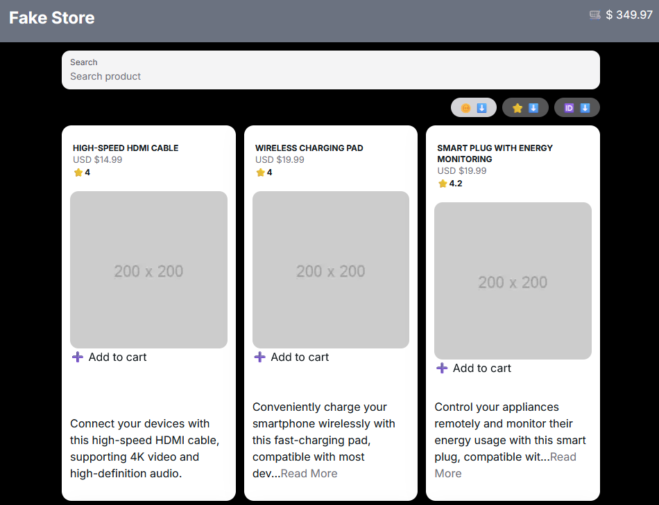

# Fake Store

A simple fake store using json-server , NextJs, Redux, and tailwind.

Test app to apply to ~~redacted~~ company with a timeframe of 24 hours.



## Getting Started

First, install the packages

```
npm install
```

then , run the development server:

```bash
npm run dev
# or
yarn dev
# or
pnpm dev
# or
bun dev
```

Open [http://localhost:8080](http://localhost:8080) with your browser to see the result.
the DB will be [http://localhost:3000/products](http://localhost:3000/products)

The DB start automatically when you run the dev server.
but if you want to run it manually you can do it with the following command

```bash
npx json-server db.json
```

## Problems

Due issues with json-server 1.0.0-beta.2 the "name_like="query is not supported in that version so I only implemented the search from the pagination results, it is posible to capture all the data and then filter it but is not the ideal scenario. [issue](https://github.com/typicode/json-server/issues/1509)

While I don’t have extensive experience with Tailwind CSS, I’ve found it to be a valuable tool for creating components with a specific design aesthetic. Personally, I lean toward Sass, but learning about Tailwind during this test has been a pleasant surprise. As for testing, I’m short on time and haven’t worked with Jest, but based on how straightforward it is to create components, I assume adding tests wouldn’t be overly challenging.

### things to do / improve
- implementing test
- add SEO metadata
